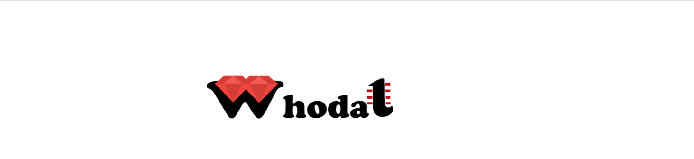

    

Whodat - A simple, easy to use, authentication gem for Rails
* An MVC solution built on a Rails engine
* Uses BCrypt for password encryption
* Allows a quick easy user authentication
* And reference to current_user, user name and email

## Intended Use Case
Whodat is intended to be used for easy and quick access to user and sessions when developing a rails application. When you don't want a lengthy set up, use Whodat. Add the one line responsive dashboard to whatever view you want. The dashboard has a main app button to return the user to the main app index page.


## Example Application

To see Whodat in use, run Blogger app and test out the Whodat user dashboard. 


## Install

### Add this gem to your application's Gemfile:

`gem 'whodat'`

### Install the gem at the command line

`$ bundle install`

 or just add the gem as a dependency
`$ gem install whodat`

### To add the user dashboard to views in your app

Add this snippet to the header section of your application view

`<%= render partial: "whodat/dashboard/navbar", action: "index" %>`

### To add current_user helper method to your application

   Add this snippet to your main app application controller
   Then you can use current_user in any controller or view in your app
   
```
     helper_method :current_user
     def current_user
        @current_user ||= ::Whodat::User.find(session[:user_id])
     end
```

### To add user to a class

Add a migration to add user as reference to your table
`rails g AddUserToYourTableName user:references`

And don't forget to run the migration
```
rake Whodat:install:migrate
rake db:migrate
```

Now you can refer to Whodat user attributes in your views
user attributes:  id, name, and email 

`<%= @class_instance.user.name %>`

## How to Help

### Code of Conduct
[Code of Conduct](/CODE-OF-CONDUCT.md)

### Did you find a bug?

* Do not open up a GitHub issue if the bug is a dependency security vulnerability.
* Ensure the bug was not already reported by searching on GitHub under Issues.
* If you're unable to find an open issue addressing the problem, open a new one. Be sure to include a title and clear description, as much relevant information as possible, what was expected, and a code sample or an executable test case demonstrating the expected behavior that is not occurring.

### Want to contribute?

[Read How to Contribute](/HOW-TO-CONTRIBUTE.md)

After forking, cloning, creating your upstream repo and branch..
Run the internal "dummy" app to test the engine enter on your command line:

`bin/rails server -b 127.0.0.1`

and open your browser to localhost:3000

### Do you have questions about the source code?
Ask any questions about how to use whodat.
Thank you for your interest!
[Contact the Administrator](me@barbaraperlik.com)

## License
The gem is available as open source under the terms of the [MIT License](https://opensource.org/licenses/MIT).
